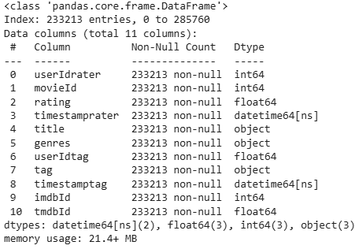
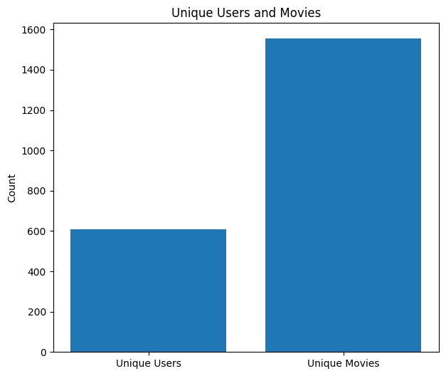
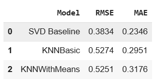

# **Movie Recommendation System**
This project creates a movie recommendation system. It addresses the challenge of providing personalized content. The system enhances user experience and engagement.
- **The Challenge:** Movie streaming services face user frustration due to lack of tailored content, leading to decreased interaction and potential revenue loss.

- **The Solution:** a recommendation system based on user ratings and preferences can improve the viewing experience.

- **Benefits:** the system uses data-driven insights to provide tailored movie recommendations, which increases user engagement and pleasure.

- **Business Impact:** Improves conversion rates, customer happiness, and user retention

# **Project Objectives**
1. **User Engagement:** Keep viewers engaged longer with tailored suggestions.
2. **Recommendation Diversity:** Balance familiarity with exploration of new content.
3. **Content Discoverability:** Showcase a broader selection of films to users.

- The data was sourced from the popular [MovieLens](https://grouplens.org/datasets/movielens/latest/) dataset from the GroupLens research lab at the University of Minnesota. The different subsets (movies, ratings, links, tags) were merged.

- After dropping null values, 233,213 records remained.

- The data ranges from March 1996 to September 2018.

- There are 610 unique users and 1,554 unique movies.  

# **Models Trained**
1. Baseline - Singular Value Decomposition with basic parameters
2. Model 2: KNNBasic
3. Model 3: KNNWithMeans

- A low Root Mean Squared Error (RMSE) means that a model is able to make more accurate predictions.
- A low Mean Absolute Error (MAE) indicates less difference between the predicted and actual ratings

4. Tuned SVD Model
- The best initial model was the basic SVD. It had an RMSE of 0.3834 and an MAE: 0.2346.
It made the best candidate for hyperparameter tuning with GridSearchCV. 

**Results**  
RMSE: 0.3642  
MAE: 0.2188

# **Conclusion**
This project developed a personalized movie recommendation system using user ratings. The tuned SVD model outperformed baseline models (RMSE and MAE), delivering accurate movie suggestions. The system generates the top 5 movie recommendations based on user preferences and history, enhancing user engagement and content discoverability.

# **Recommendations**
- **Deployment & Integration:** Integrate the system into movie streaming platforms for real-time recommendations.
- **Continuous Monitoring:** Regularly evaluate system performance and gather user feedback to refine recommendations.
- **Feature Enhancement:** Add preferences for genres, actors, and sentiment analysis for improved personalization.
- **Scalability:** Ensure the system can scale to accommodate growing user bases and movie libraries.

# **Way Forward**
- **Model Refinement:** Collaborative filtering with implicit feedback or hybrid approaches for better suggestion accuracy.
- **Content-Based Filtering:** Using movie metadata (genres, actors, directors, keywords) in conjunction with collaborative filtering, so that films that are similar to those that the user has already loved will be suggested.
- **User Interface/User Experience (UI/UX) Optimization:**  Create a simple and easy-to-use interface with features like movie trailers, synopses, and ratings to display the suggestions.
- **Personalized Search:**  Expand the recommendation system to allow users to customize movie search results according to their preferences.
